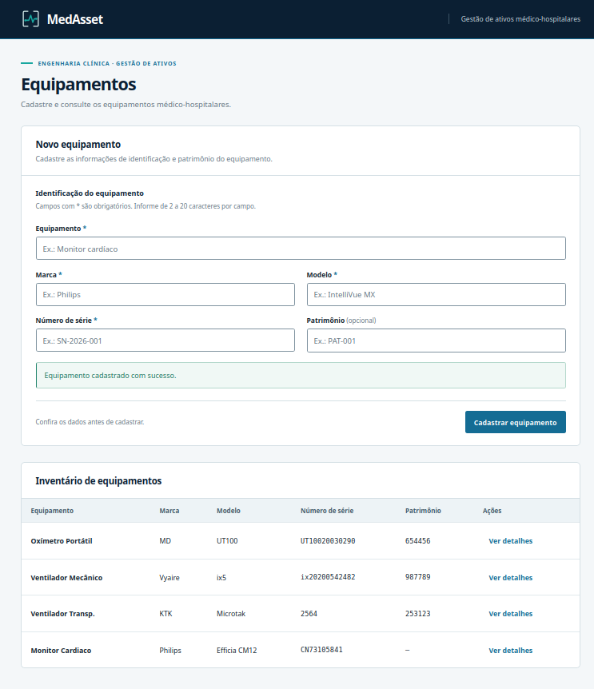
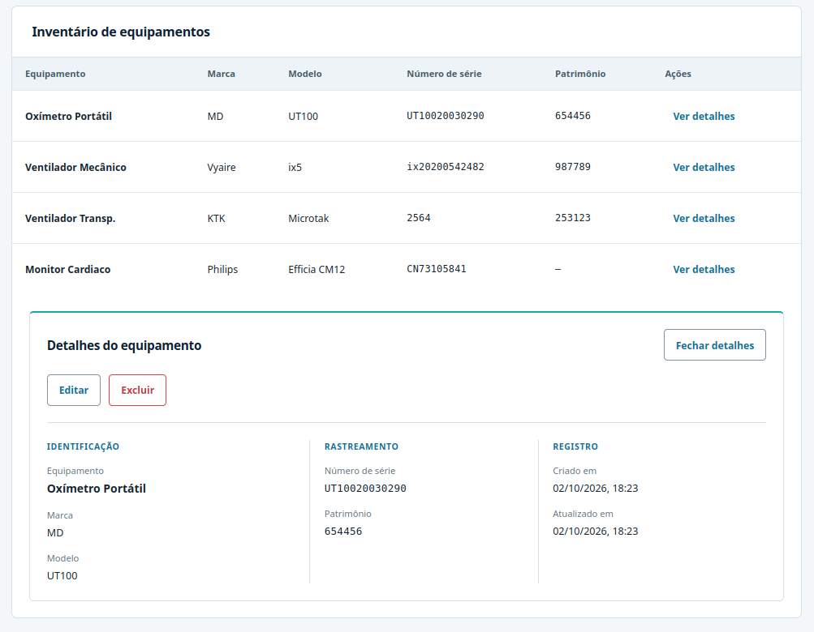
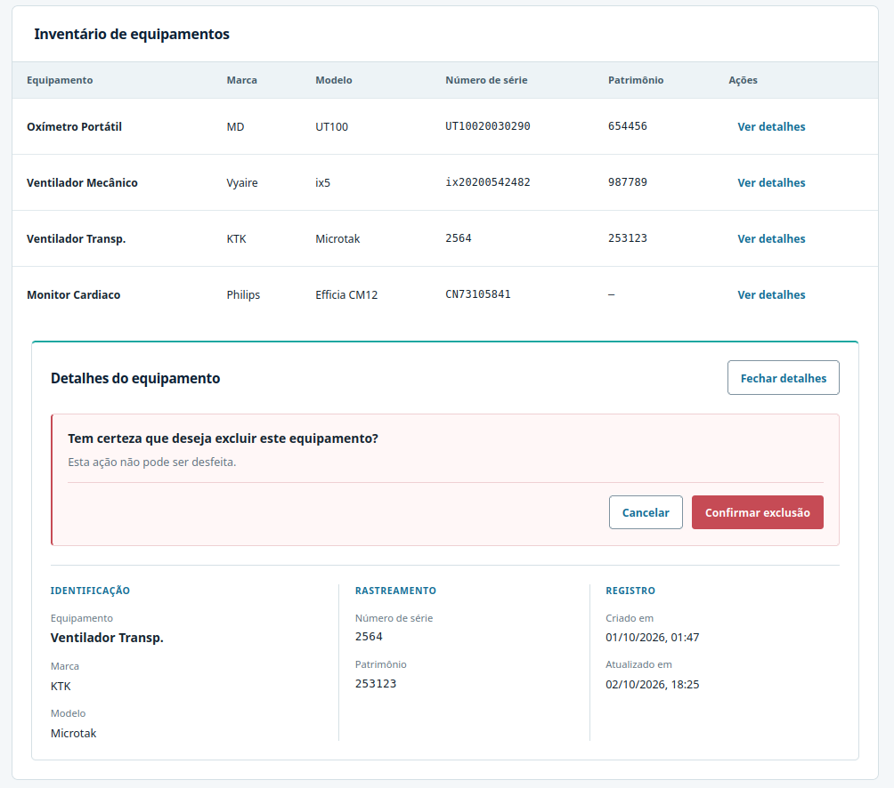

# MedAsset

**Sistema full stack para gestão de ativos médico-hospitalares, inspirado em necessidades reais de engenharia clínica.**

O MedAsset centraliza o cadastro e a consulta de equipamentos utilizados em ambientes de saúde. A identificação por número de série e patrimônio apoia a rastreabilidade dos ativos, enquanto a validação das entradas e o controle de duplicidade preservam a integridade dos dados.



## Funcionalidades implementadas

- Cadastro, listagem e consulta de detalhes de equipamentos.
- Edição dos dados de identificação e patrimônio.
- Exclusão com confirmação na interface.
- Número de série obrigatório e único.
- Patrimônio opcional e único quando informado.
- Validação no backend e tratamento controlado de erros.
- Persistência em PostgreSQL.
- Interface responsiva.
- Testes automatizados no frontend e no backend.

## Fluxo da aplicação

```text
React
  ↓ HTTP
NestJS Controller
  ↓
Service
  ↓
Repository
  ↓
Prisma
  ↓
PostgreSQL
```

O **React** apresenta os formulários, o inventário e os detalhes, consumindo a API por funções específicas de acesso HTTP. O **controller** recebe entradas validadas, chama o service e traduz erros da aplicação em respostas HTTP. O **service** concentra as regras de negócio e coordena o **repository**, responsável pela persistência por meio do **Prisma** no **PostgreSQL**.

## Tecnologias

| Área                 | Tecnologias                                         |
| -------------------- | --------------------------------------------------- |
| Frontend             | React, TypeScript e Vite                            |
| Backend              | Node.js, NestJS e TypeScript                        |
| Persistência         | PostgreSQL e Prisma ORM                             |
| Qualidade            | Jest, Testing Library, Supertest, ESLint e Prettier |
| Infraestrutura local | Docker Compose                                      |

## Detalhes da interface

O painel de detalhes organiza os dados em identificação, rastreamento e registro. A partir dele, é possível editar o equipamento ou iniciar a exclusão com confirmação.





## Decisões técnicas

- **Regras no service:** existência e duplicidade são verificadas na camada de negócio.
- **Controller focado em HTTP:** rotas delegam ao service e traduzem erros conhecidos para os status correspondentes.
- **Repository separando negócio de Prisma:** o service depende do contrato de persistência; a implementação concentra as operações do ORM.
- **Validação também no backend:** DTOs e `ValidationPipe` validam as entradas e rejeitam propriedades não previstas, independentemente da interface.
- **Unicidade no banco:** constraints protegem número de série e patrimônio. O tratamento de duplicidade identifica os campos em conflito e retorna `409 Conflict` quando o conflito é reconhecido.
- **Exclusão física:** nesta versão, a operação remove o registro do banco após confirmação na interface.
- **Arquitetura proporcional ao escopo:** camadas com responsabilidades claras, componentes específicos e callbacks locais mantêm os fluxos compreensíveis, sem estado global ou abstrações genéricas desnecessárias.

## Testes e qualidade

Os testes automatizados cobrem regras de negócio, operações do repository de persistência, contrato HTTP e comportamento do frontend. Jest executa as suítes; Supertest verifica as respostas da API; Testing Library exercita as interações com a interface.

Os testes do repository usam Prisma simulado, e os testes HTTP substituem a persistência. Essa cobertura não equivale a testes de integração com uma instância real do PostgreSQL. No frontend, as respostas da API também são simuladas.

ESLint, Prettier e os builds com TypeScript complementam as verificações de qualidade.

## Regras principais

- Número de série é obrigatório e único.
- Patrimônio é opcional e deve ser único quando informado.
- Equipamento, marca, modelo e número de série devem conter entre 2 e 20 caracteres; o mesmo limite vale para patrimônio quando informado.
- Na edição, omitir o patrimônio remove o valor anterior.
- Propriedades não previstas no contrato de entrada são rejeitadas com `400 Bad Request`.
- Conflitos de número de série e patrimônio identificados pela aplicação retornam `409 Conflict`, com mensagem de negócio.
- Equipamento inexistente em consulta, edição ou exclusão retorna `404 Not Found`.

## Contexto

O projeto conecta experiência real em saúde e engenharia clínica com desenvolvimento de software. O conhecimento das rotinas de identificação e controle de equipamentos orienta a construção de uma aplicação voltada à organização dos ativos e à confiabilidade dos registros.

## Evoluções planejadas

Os itens abaixo ainda não estão implementados:

- Busca e filtros.
- Status operacional.
- Histórico e acompanhamento de manutenção.
- Autenticação.
- Perfis de acesso.

## Autoria

Josiane Gonçalves
